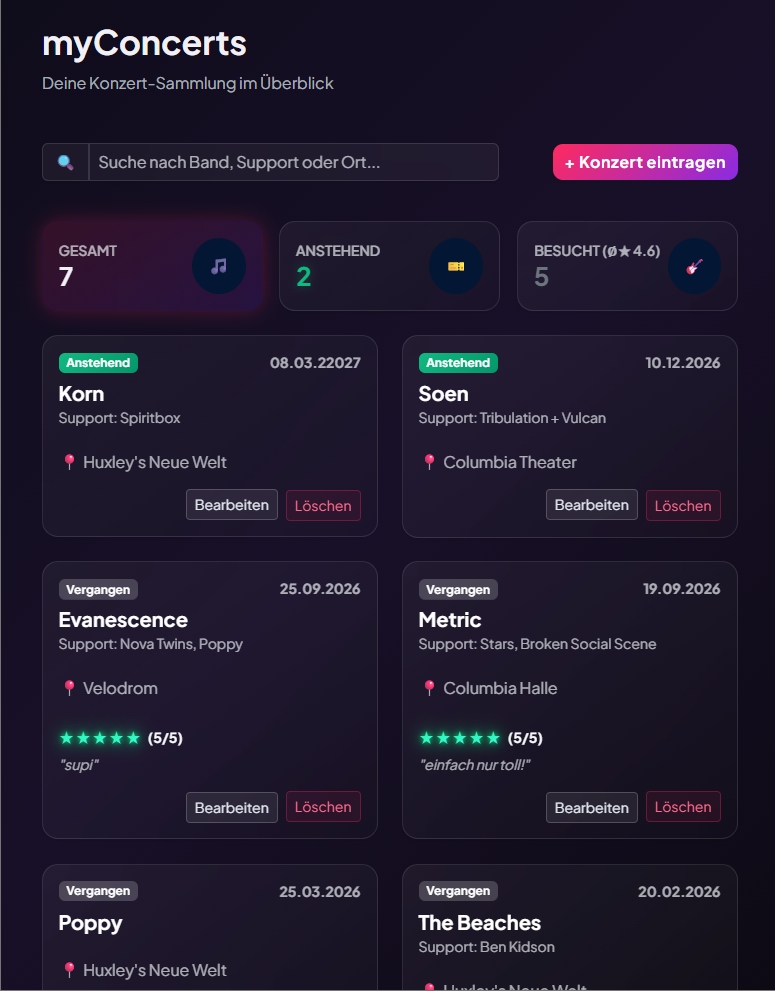
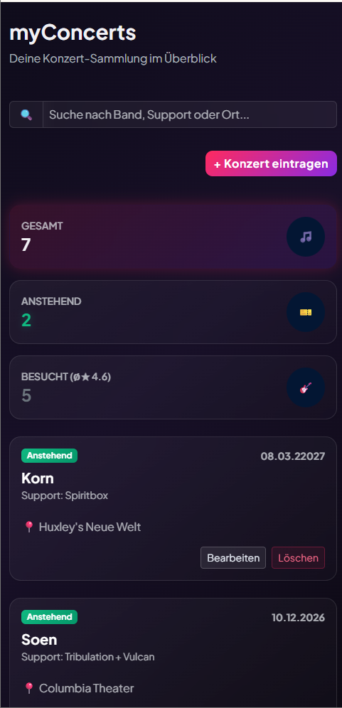

# MyConcerts App 🎵

## 🎸 Beschreibung

**MyConcerts** ist eine moderne Webanwendung zur übersichtlichen Verwaltung und Bewertung von Live-Konzerten. Die Anwendung ermöglicht es Musikbegeisterten, anstehende Events zu planen sowie vergangene Konzerterlebnisse mit Bewertungen und persönlichen Erinnerungen festzuhalten.

---

## ✨ Features

- **Chronologische Kachelansicht:** Automatische Sortierung aller Konzerte nach Datum (von der Zukunft bis in die Vergangenheit).

- **Visuelle Status-Badges:** Klare Unterscheidung zwischen anstehenden (neongrün) und vergangenen Konzerten (dezentes silber).

- **Dashboard & Filter:** Live-Kennzahlen zur Gesamtanzahl sowie Aufteilung in zukünftige und vergangene Events inkl. Schnellfilterung über das Dashboard.

- **Echtzeit-Suchleiste:** Durchsucht Künstler/Bands, Support-Acts und Veranstaltungsorte gleichzeitig.

- **Konzert-Verwaltung (CRUD: **C**reate/Erstellen, **R**ead/Anzeigen, **U**pdate/Bearbeiten, **D**elete/Löschen):**

    - **Hinzufügen & Bearbeiten:** Eingabemaske mit Pflicht- & Optionalfeldern für Hauptact, Support-Acts, Location, Datum (Browser-nativer HTML5-Datepicker) sowie ein 1–5-Sterne-Bewertungssystem und Notizen für vergangene Events.

    - **Sicheres Löschen:** Löschfunktion mit Bestätigungsdialog zum Schutz vor versehentlichem Entfernen.
    
- **Responsive Design:** Optimierte Darstellung für Desktop, Tablet und Smartphones umgesetzt mit Bootstrap.   

---

## 📸 Screenshots


Abb. 1: Startseite mit Dashboard (Anzahl Einträge pro Kategorie: Gesamt, Anstehnd, Vergangen), Suchleiste und chronologisch aufgeführten Konzerteinträgen sowie Button zum Erstellen eines Eintrags


Abb. 2: Filterung der angezeigten Konzerteinträge über Dashboard


Abb. 3: Filterung der angezeigten Konzerteinträge nach Übereinstimmung der Eingabe in Suchleiste mit Hauptact, Support Acts oder Veranstaltungsort


Abb. 4: Anzeige "Keine Konzerte gefunden", wenn keine Übereinstimmung der Eingabe in Suchleiste (entspricht Anzeige, wenn noch keine Einträge vorhanden)


Abb. 5: Komponente zum Erstellen eines Konzerteintrags (selber Aufbau für die Bearbeiten-Komponente) mit 2 Pflichtfelder, ohne deren Eingabe Speichern nicht möglich ist


Abb. 6: Browser-nativer HTML5-Datepicker, um ein Datum auszuwählen


Abb. 7: Vergabe einer Bewertung von 1 bis 5 Sternen (Sterne reagieren interaktiv auf Klick und können wieder gelöscht werden)


 
Abb. 8: Dialog beim Löschen eines Konzerteintrags



Abb. 9: Responsives Design Medium



Abb. 10: Responsives Design Small

---

## 🛠️ Verwendete Technologien & KI

- **Frontend** Angular (Signals, Reactive Forms, Router)
- **Styling:** Bootstrap 5, Custom CSS
- **Sprache:** TypeScript, HTML, CSS

- **Backend**: Node.js mit Express.js
- **Datenbank**: MongoDB Atlas / Mongoose

- **Verwendung von Google Gemini** (Session-based Context , Iterative Co-Creation):
    - Brainstorming, Anleitungen und Verständnisfragen
    - Generierung, Optimierung und Erklärung von Code, Fehlersuche
    - Unterstützung bei READ.ME

---

## 🚀 Lokales Setup

### Voraussetzungen

* [Node.js](https://nodejs.org/) (Version 18 oder höher)
* [npm](https://www.npmjs.com/) (wird mit Node.js installiert)
* [Git](https://git-scm.com/)
* Ein kostenloser Account bei [MongoDB Atlas](https://www.mongodb.com/cloud/atlas) (für den Datenbank-Zugriff)

#### 1. Repositories klonen
```bash
git clone [https://github.com/annika-schwarz/MyConcerts-frontend.git](https://github.com/DEIN-BENUTZERNAME/MyConcerts.git)
git clone [https://github.com/annika-schwarz/MyConcerts-frontend.git](https://github.com/DEIN-BENUTZERNAME/MyConcerts.git)
cd MyConcerts


## Next Steps