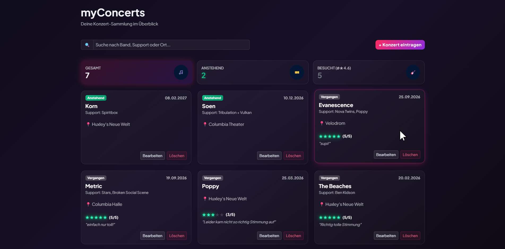
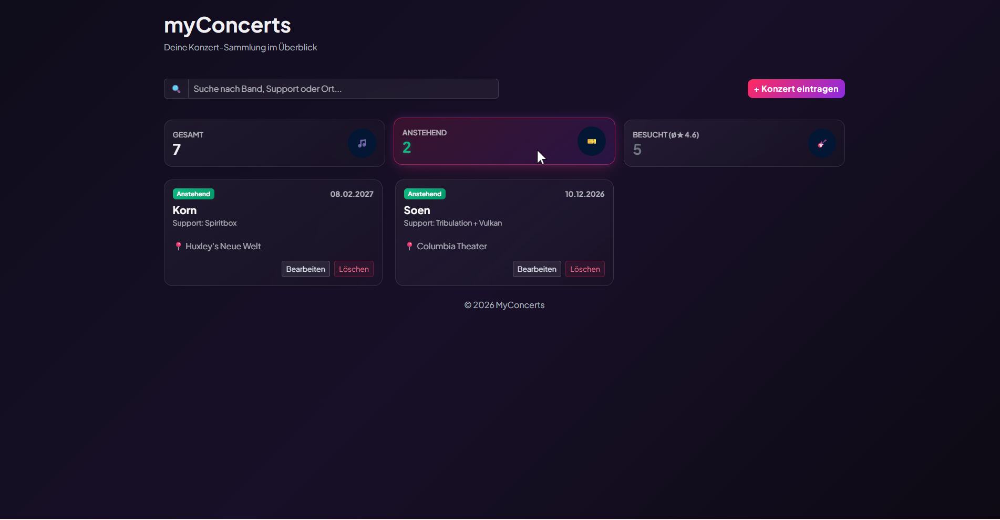
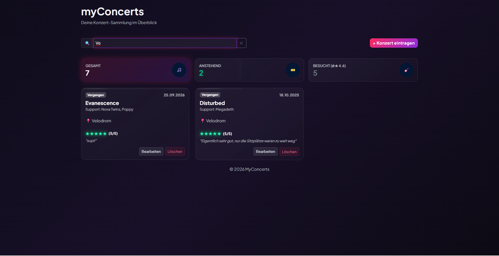
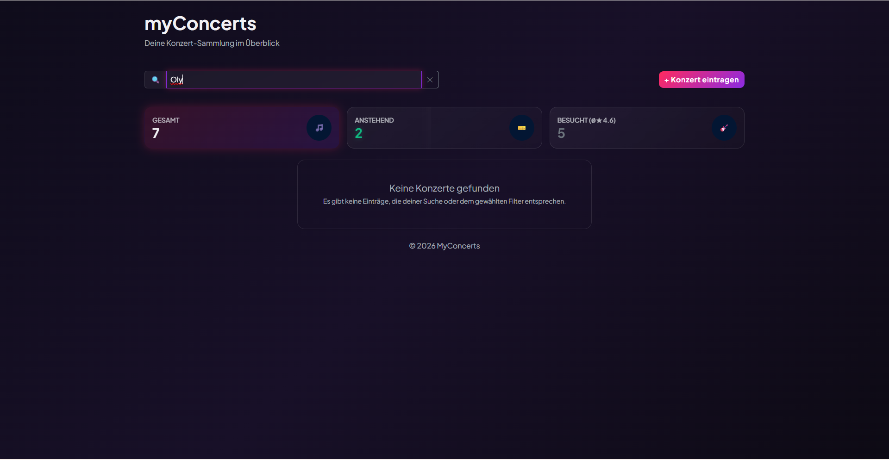
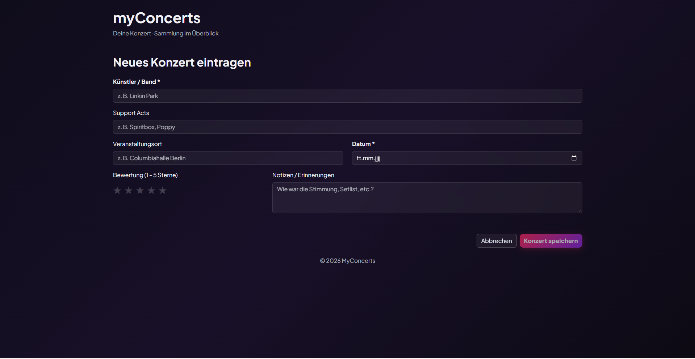
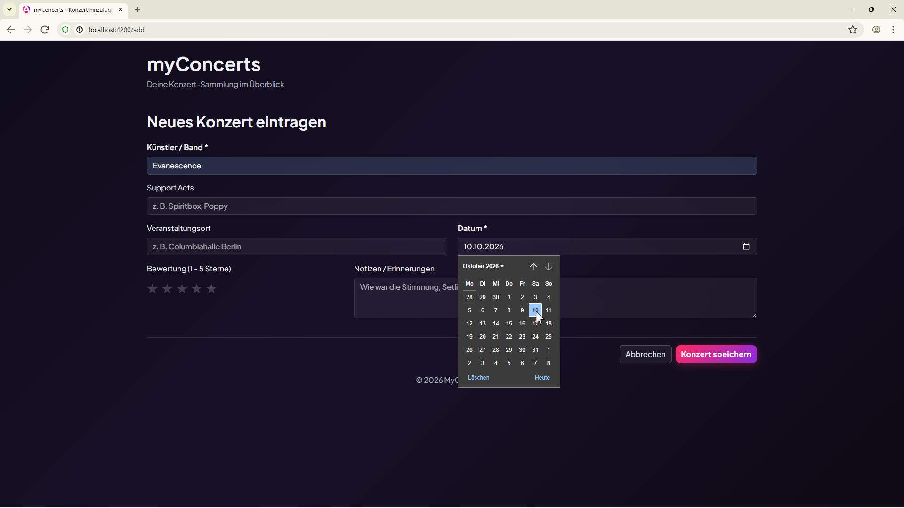
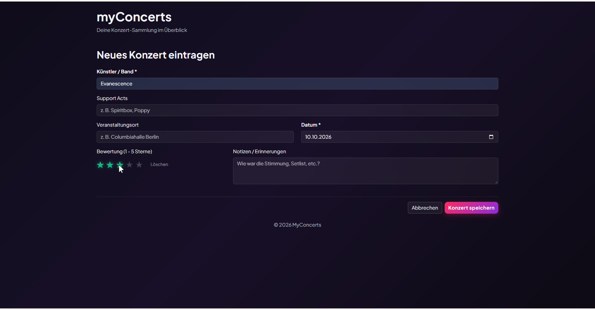
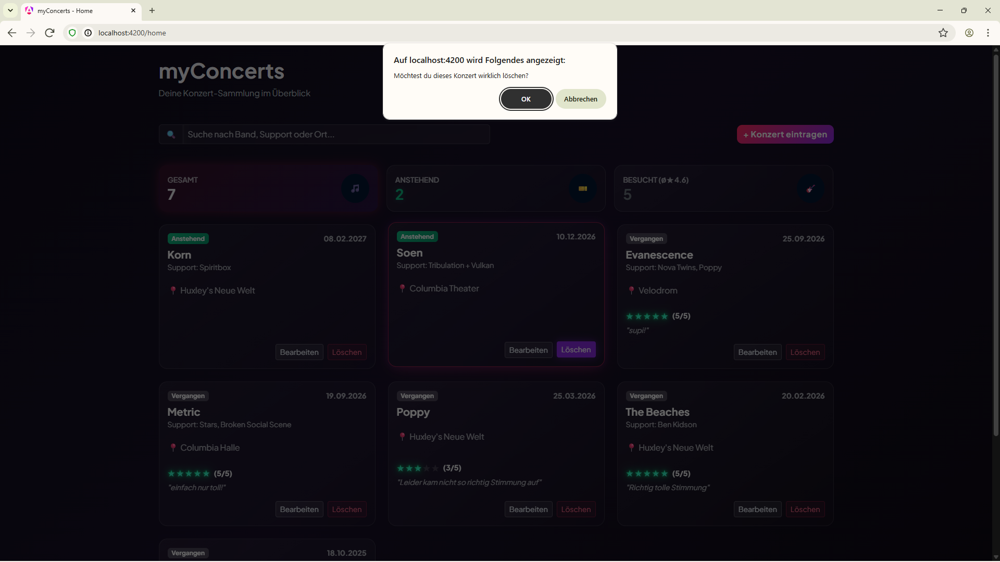

# MyConcerts App 🎵

## Beschreibung

**MyConcerts** ist eine moderne Webanwendung zur übersichtlichen Verwaltung und Bewertung von Live-Konzerten. Die Anwendung ermöglicht es Musikbegeisterten, anstehende Events zu planen sowie vergangene Konzerterlebnisse mit Bewertungen und persönlichen Erinnerungen festzuhalten.

---

## Features

- **Chronologische Kachelansicht:** Automatische Sortierung aller Konzerte nach Datum (von der Zukunft bis in die Vergangenheit).

- **Visuelle Status-Badges:** Klare Unterscheidung zwischen anstehenden (neongrün) und vergangenen Konzerten (dezentes silber).

- **Dashboard & Filter:** Live-Kennzahlen zur Gesamtanzahl sowie Aufteilung in zukünftige und vergangene Events inkl. Schnellfilterung über das Dashboard.

- **Echtzeit-Suchleiste:** Durchsucht Künstler/Bands, Support-Acts und Veranstaltungsorte gleichzeitig.

- **Konzert-Verwaltung (CRUD: **C**reate/Erstellen, **R**ead/Anzeigen, **U**pdate/Bearbeiten, **D**elete/Löschen):**

    - **Hinzufügen & Bearbeiten:** Eingabemaske mit Pflicht- & Optionalfeldern für Hauptact, Support-Acts, Location, Datum (Browser-nativer HTML5-Datepicker) sowie ein 1–5-Sterne-Bewertungssystem und Notizen für vergangene Events.

    - **Sicheres Löschen:** Löschfunktion mit Bestätigungsdialog zum Schutz vor versehentlichem Entfernen.
    
- **Responsive Design:** Optimierte Darstellung für Desktop, Tablet und Smartphones umgesetzt mit Bootstrap.   

## 📸 Screenshots


| Startseite mit Dashboard, Suchleiste und chronologisch aufgeführten Konzerteinträgen sowie Button zum Erstellen eines Eintrags|


| Filterung der angezeigten Konzerteinträge über Dashboard |


| Filterung der angezeigten Konzerteinträge nach Übereinstimmung der Eingabe in der Suchleiste mit Hauptact, Support Acts oder Veranstaltungsort |


| Anzeige "Keine Konzerte gefunden, wenn keine Übereinstimmung der Eingabe in der Suchleiste mit Hauptact, Support Acts oder Veranstaltungsort (entspricht der Anzeige, wenn noch keine onzerte vorhanden) |


|Komponente zum Erstellen eines Konzerteintrags (selber Aufbau für die Bearbeiten-Komponente) mit 2 Pflichtfelder ohne deren Eingabe Speichern nicht möglich ist |


| Browser-nativer HTML5-Datepicker, um ein Datum auszuwählen |


| Vergabe einer Bewertung von 1 bis 5 Sternen (Sterne reagieren interaktiv auf Klick) |

 
| Dialog beim Löschen eines Konzerteintrags | 

---

## ✨ Features

- **Konzertübersicht:** Alle vergangenen und zukünftigen Konzerte im Überblick.
- **Suchen & Filtern:** Schnelles Filtern nach Künstlern, Orten oder Daten.
- **Konzert hinzufügen & bearbeiten:** Erfassen von Künstlern, Support-Acts, Event-Orten und Daten.
- **Bewertungssystem:** Sterne-Bewertung und Notizen für besuchte Konzerte.
- **Responsive Design:** Optimiert für Desktop und mobile Endgeräte.

---

## 🛠️ Verwendete Technologien & KI-Einsatz

- **Framework:** Angular (Signals, Reactive Forms, Router)
- **Styling:** Bootstrap 5, Custom CSS
- **Sprache:** TypeScript, HTML, CSS

---

## 🚀 Lokales Setup

1. **Repository klonen:**
   ```bash
   git clone <DEIN_GIT_REPOSITORY_LINK>


## Next Steps